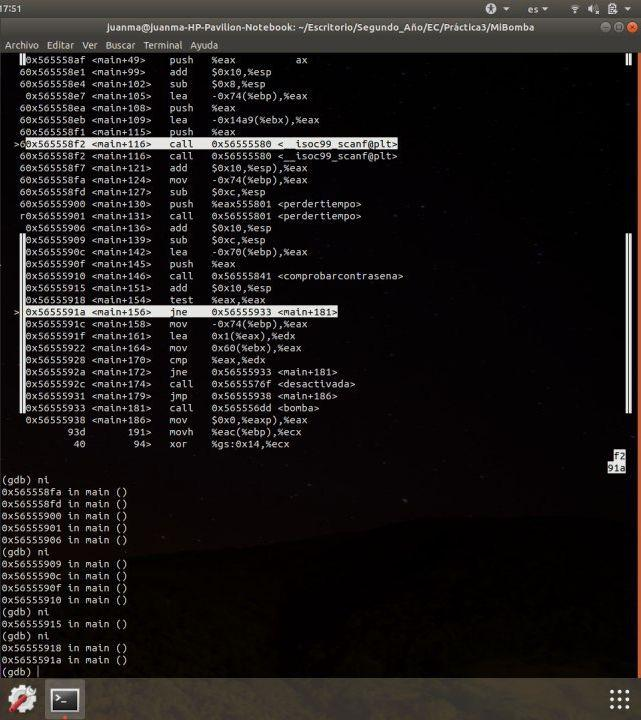
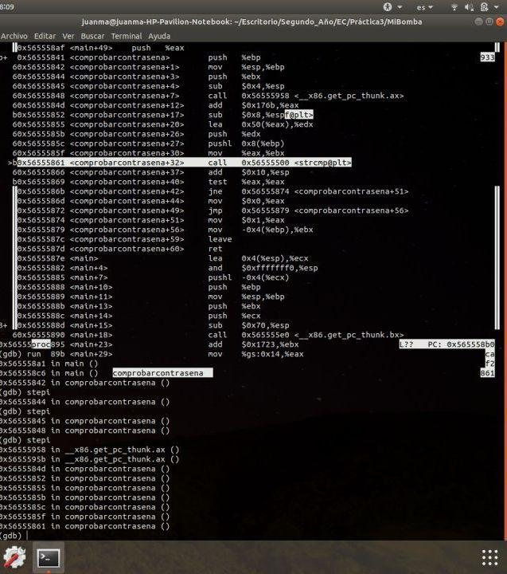
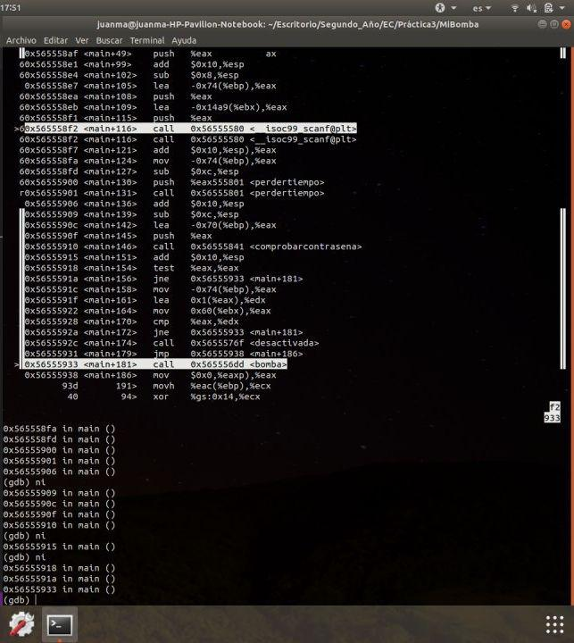
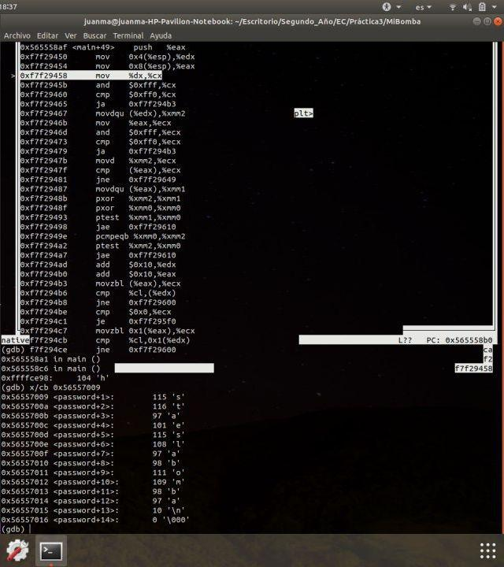
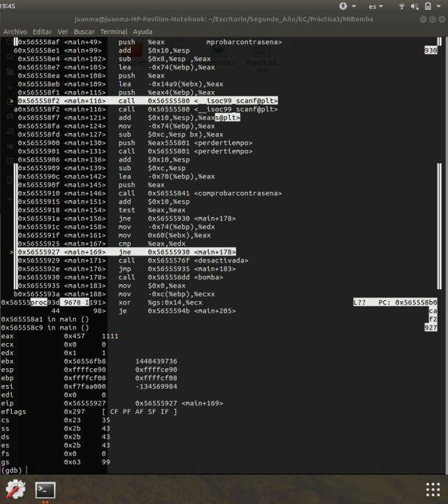

*Juan Manuel Mateos Pérez*

#PRÁCTICA 3

En primer lugar vamos a realizar una primera depuracion del programa en gdb.

### Primera Depuración
En esta primera depuración que realizo simplemente me hago una primera idea del programa.

Para poder comenzar a depurar debemos poner un **breakpoint** al inicio del main, con el comando `break main`. Posteriormente avanzamos cada instrucción con `nexti`.
El programa comienza pidiendome una **contraseña**, que, al no tener conocimiento de cual es, introduzco la contraseña `hola`, por ejemplo.
Avanzo el programa hasta que me pide el **codigo**, pero como tampoco lo conozco introduzco `1`.
Ahora observamos como el programa avanza pero no realiza ninguna comparación, por tanto, podemos intuir que está realizando operaciones secundarias que no afectan al **codigo** ni a la **contraseña**.

Vemos ahora que el programa entra en una funcion llamada `comprobarcontraseña` que no sabemos que realiza, asi que debemos recordar volver a entrar en la función en futuras depuraciones.

Finalmente en esta depuración nos hemos dado cuenta que ha saltado a la linea 181 del main y en ese punto ha llegado a la función `bomba` y al introducir `next i` termina el programa y explota la bomba. De todo esto podemos saber que la funcion `bomba` hace que explote la bomba, y a ella hemos llegado a partir de la funcion `comprobarcontraseña` por tanto debemos introducir en la siguiente depuración un **breakpoint** en esa funcion.

### Segunda Depuración

En esta segunda depuración que realizo tengo como objetivo incorporar un **breakpoint** en la función `comprobarcontraseña`. Para ello simplemente avanzo el programa, introduzco los mismos valores de **contraseña** y **codigo** y avanzo hasta la función que busco. Para acceder a la función utilizo el comando `stepi` que me permite recorrerla.

Una vez dentro de ella, debemos buscar alguna pista donde poder encontrar la contraseña buscada. Si nos damos cuenta, se realiza una comparación dentro de la funcion, lo que puede ser la comparacion de la contraseña verdadera con la introducida.

Para intentar buscar la contraseña verdadera accedemos a la funcion `strcmp` que se encuentra dentro de `comprobarcontraseña`, mediante el comando `stepi`.

Dentro de esta función tenemos que ir buscando los valores de los registros. Nos damos cuenta que al inicio de la intrucción modifica algunos valores de los registros `eax` y `edx` por tanto vamos a mostrar los valores en memoria de estos registros para ver si alguno almacena la contraseña correcta.

Para ello vamos a usar el comando `x/cb $registro` que muestra el valor en memoria del registro introducido. Como podemos observar, el registro `eax` muestra el caracter 'e', que sabemos que es el primer caracter de la contraseña por lo que hemos encontrado la direccion de memoria de la contraseña.

Finalmente solo debemos ir accediendo a las siguiguientes posiciones de memoria para ir conociendo el valor completo de la contraseña. Para ello, como sabemos que la posicion del primer caracter es, en mi caso `0x56557008`, para conocer las siguientes posiciones de memoria debemos introducir el comando `x/cb 0x56557009` y así sucesivamente hasta llegar al `\n`. De esta forma hemos conseguido el valor de la **contraseña**, que en mi caso es `estaeslabomba`.

### Tercera Depuración

En esta depuración debemos buscar el valor del **codigo**. A partir de aqui voy a introducir la contraseña correcta.

Para ello comenzamos avanzando hasta la funcion `comprobarcontraseña` donde probablemente se realice la comprobación del código al igual que la de la contraseña. Cuando lleguamos esta función la recorremos buscando comparaciones entre el codigo pero la recorremos entera y no hemos encontrado nada. Por tanto esta comparación debe estar tras la funcion `comprobarcontraseña`.

Si nos damos cuenta, tras la función podemos observar que hay una comparación que realiza el comando `cmp %eax, %edx`, comando que puede resultarnos sospechoso. Para poder comprobar si esta comparación es la del codigo, aplicamos el comando `info register` que nos aporta los datos de los registrros, en particular, `edx` y `eax`. Si nos percatamos, `edx` contiene el valor del codigo que hemos introducido mientras que `eax` contiene el valor del **codigo original**. Así hemos conseguido extraer la **contraseña** y el **codigo** del programa.

Concluimos la Práctica diciendo la solucion del programa:

|contraseña|codigo|
|---|---|
|estaeslabomba|1111|
